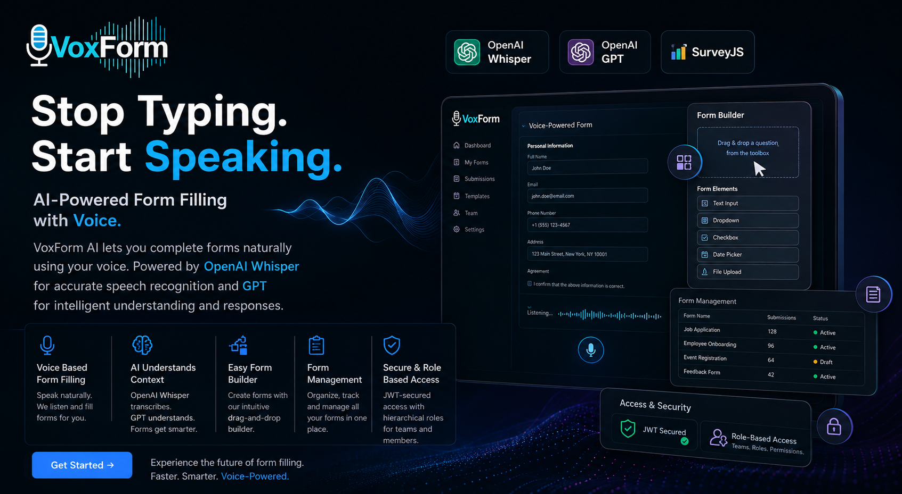
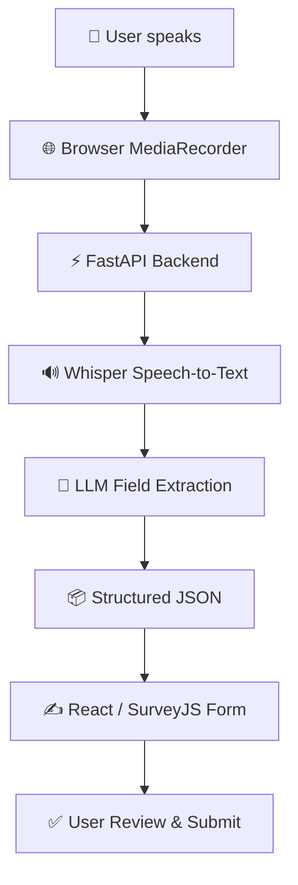

# 🎙️ VoxForm AI



<p align="center">
  <font size="5"><b><i>VoxForm AI - Fill Forms at the Speed of Speech</i></b></font>
</p>


VoxForm AI is an **AI-powered form filling platform** that allows users to fill forms using natural voice input instead of manually typing every field.

Users simply speak their responses. VoxForm transcribes the audio using **Whisper**, uses an **LLM to understand and extract field values**, and dynamically populates the corresponding form fields.

It also provides a powerful **drag-and-drop form builder**, form management, team-based access control, and secure multi-tenant authentication.

**🌐 Live Application:** https://www.voxform.online/


---


## ✨ Key Features

* 🎙️ **Voice-based Form Filling** — Speak naturally and let AI populate form fields.
* 🔊 **Whisper Speech-to-Text** — Fast and multilingual voice transcription.
* 🧠 **LLM-powered Field Extraction** — Maps spoken answers to the correct form fields.
* 🏗️ **Drag-and-Drop Form Builder** — Build complex forms using SurveyJS without coding.
* 📋 **Form Management** — Create, edit, manage, and reuse forms and templates.
* 🔐 **JWT Authentication** — Secure authentication using HttpOnly cookies.
* 🏢 **Multi-Tenant Architecture** — Organisation-scoped data isolation.
* 👥 **Role-Based Access** — Separate capabilities for Org Admins and Respondents.
* 📤 **CSV Export** — Export submitted responses for analysis.
* 📝 **Transcript & Manual Review** — Review the AI transcript and correct extracted values before submission.

---

## 🚀 How It Works

VoxForm follows a simple **Voice → Transcribe → Extract → Fill** pipeline:

<!-- ```text
🎤 User speaks
      ↓
🌐 Browser MediaRecorder
      ↓
⚡ FastAPI Backend
      ↓
🔊 Whisper Speech-to-Text
      ↓
🧠 LLM Field Extraction
      ↓
📦 Structured JSON
      ↓
✍️ React / SurveyJS Form
      ↓
✅ User Review & Submit
``` -->



### 1. 🎤 Speak Naturally

The respondent opens a form and records their answers using the browser's `MediaRecorder` API.

### 2. 🔊 Transcribe

The audio is sent to the FastAPI backend and transcribed using **OpenAI Whisper**, hosted through the **Groq API**.

### 3. 🧠 Extract Fields

The transcript and the form schema are passed to an LLM. The model identifies which spoken answers correspond to which form fields and returns structured JSON.

### 4. ✍️ Fill the Form

The extracted values are returned to the frontend and automatically populated into the corresponding form fields.

### 5. ✅ Review & Submit

Users can review and manually correct the generated values before submitting the form.

---

## 🏗️ System Architecture

VoxForm is built around a decoupled frontend, API, AI-processing, and persistence architecture.

```text
                         ┌──────────────────┐
                         │      User        │
                         └────────┬─────────┘
                                  │
                                  ▼
                         ┌──────────────────┐
                         │ React / Next.js  │
                         │    SurveyJS      │
                         └────────┬─────────┘
                                  │
                                  ▼
                         ┌──────────────────┐
                         │     FastAPI      │
                         │     REST API     │
                         └───────┬──────────┘
                                 │
                  ┌──────────────┼──────────────┐
                  │              │              │
                  ▼              ▼              ▼
             ┌─────────┐   ┌──────────┐   ┌──────────┐
             │ Whisper │   │   LLM    │   │  MySQL   │
             │   STT   │   │Extractor │   │ Database │
             └─────────┘   └──────────┘   └──────────┘
                  │              │
                  └──────┬───────┘
                         ▼
                  Structured Form
                       Values
```

### Core Components

| Component           | Responsibility                            |
| ------------------- | ----------------------------------------- |
| **Next.js / React** | Frontend application and user interface   |
| **SurveyJS**        | Form builder and form rendering           |
| **FastAPI**         | REST API and application backend          |
| **Whisper**         | Speech-to-text transcription              |
| **Groq API**        | Fast AI inference                         |
| **LLM**             | Voice transcript → structured form fields |
| **SQLAlchemy**      | Database ORM                              |
| **MySQL**           | Persistent application data               |
| **PyJWT**           | JWT authentication                        |
| **bcrypt**          | Password hashing                          |
| **Uvicorn**         | ASGI application server                   |

---

## 🧩 Technology Stack

### Frontend

* ⚛️ React 19
* ▲ Next.js
* 🎨 Tailwind CSS
* 📋 SurveyJS

### Backend

* 🐍 Python
* ⚡ FastAPI
* 🚀 Uvicorn
* 🗄️ SQLAlchemy 2
* 🐬 MySQL
* ✅ Pydantic v2

### AI & Voice

* ⚡ Groq API
* 🔊 OpenAI Whisper
* 🧠 GPT / LLaMA-based LLM
* 🎤 Browser MediaRecorder API

### Security

* 🔐 JWT authentication
* 🍪 HttpOnly + SameSite cookies
* 🔑 bcrypt password hashing
* 🏢 Organisation-scoped authorization

---

## 👥 User Roles

### 👑 Org Admin

Org administrators can:

* Create, edit, and delete forms
* Build forms using SurveyJS
* Create forms from templates
* Invite and manage team members
* Configure form logic and branching
* View submitted responses
* Export responses as CSV

### 🎤 Respondent

Respondents can:

* View forms available to their organisation
* Fill forms using voice input
* Review AI-generated values
* Manually correct responses
* Submit completed forms
* View the generated transcript

---

## 🔐 Authentication & Multi-Tenancy

VoxForm uses **JWT-based authentication** with the token stored in an **HttpOnly cookie**.

The JWT contains the information required to identify the authenticated user and their organisation.

```text
JWT
 ├── user_id
 ├── org_id
 └── role
```

This enables:

* Secure session management
* Role-based authorization
* Organisation-level data isolation
* No authentication tokens stored in browser `localStorage`
* Configurable token expiry

New users are added through an **invite-only onboarding flow**:

```text
Org Admin
    ↓
Create Invitation
    ↓
Share Invite Link
    ↓
User Sets Password
    ↓
Account Created
    ↓
User Logs In
```

---

## 📋 Form Builder

VoxForm uses **SurveyJS** to provide a flexible form-building experience.

Forms can support:

* Text fields
* Choice fields
* Ratings
* Matrix questions
* Image selectors
* Multi-page forms
* Conditional logic
* Branching
* Progress indicators
* Reusable templates

The voice extraction layer works against the form's schema, allowing the same AI pipeline to work with different form structures.

---

## 📤 Response Export

Form responses can be exported as CSV.

The generated file contains:

* One row per response
* One column per form field
* Submission timestamp
* Automatically disambiguated duplicate field labels

Example:

```text
Name,Age,Notes,Notes (2),Submitted At
John,32,Good service,Follow-up required,2026-08-31 10:42:15
```

---

## ⚙️ Local Development

### Prerequisites

* Git
* Docker

### 1. Clone the Repository

```bash
git clone https://github.com/VishalMandrai/voxform-ai-app.git
cd voxform-ai-app
```

### 2. Configure Environment Variables

Create your environment file:

```bash
cp .env.example .env
```

Configure the required values, including your AI provider credentials and database configuration.

Example:

```env
GROQ_API_KEY=your_api_key
DATABASE_URL=your_database_url
JWT_SECRET_KEY=your_secret_key
```

> Refer to `.env.example` for the complete configuration.

### 3. Start the Application

```bash
docker build voxform-ai-app .
```

For rebuilding after code or dependency changes:

```bash

docker run -d --name voxform-app \
--env-file .env -p 8000:8000 \
voxform-ai-app

```

### 4. Open the Application

Once the services are running:

```text
http://localhost:8000
```

### Stop the Application

```bash
docker stop voxform-app
```

---

## 🗺️ Roadmap

Planned development includes:

* 📊 Advanced analytics dashboard
* 🎙️ Voice-based form generation
* 📈 Response analytics and visualizations
* 🔄 Additional AI model/provider integrations

---

## 📜 License

This project is licensed under the **MIT License**. See the [`LICENSE`](LICENSE) file for details.

---

<div align="center">

### 🎙️ Fill forms at the speed of speech.

**VoxForm AI — Voice-powered forms for faster data collection.**

🌐 https://www.voxform.online/

</div>


## 👋 Connect With Me

I'm always open to discussing AI, Machine Learning, Software Engineering, and interesting project ideas.

<p align="center">
  <a href="https://linkedin.com/in/vishal-mandrai999/">
    
  </a>
</p>

<p align="center">
  <a href="https://linkedin.com/in/vishal-mandrai999/">
    
  </a>
</p>


<p align="center">
<font size="1">
  <a href="https://linkedin.com/in/vishal-mandrai999/">
    
  </a>
  &nbsp;&nbsp;&nbsp;
  <a href="https://x.com/vishman__">
    
  </a>
  &nbsp;&nbsp;&nbsp;
  <a href="www.vishalm.online">
    
  </a>
  &nbsp;&nbsp;&nbsp;
  <a href="mailto:vishalm.nitt@gmail.com"> 
     
  </a>
</font>
</p>
